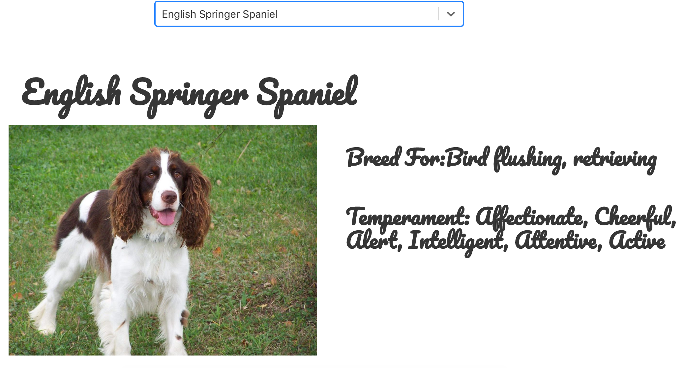
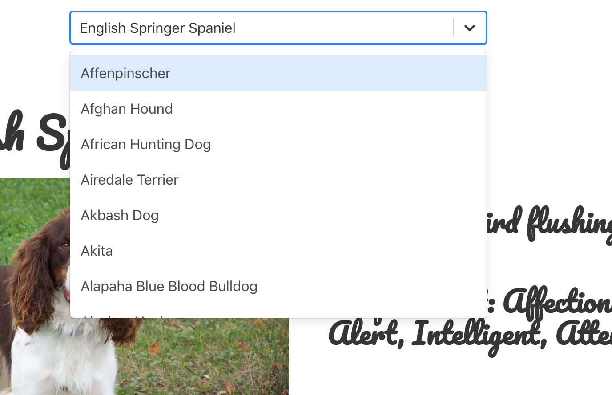

# Project 2: API Project - Doggie Browser

## Timeframe
2 days

## Technologies Used
Frontend: HTML, CSS, Bulma, React.js, Webpack, Axios, Babel
Backend: Node.js

## Installation

1. Clone or download the repo
2. Run 'npm init' in the cli

## Overview

A browser for search your favourite canine friends!

## Introduction

The second project involved our first application of the javaScript framework React.js, and using it in tandem with an API of our choosing. Ours happened to be one of our canine compadres.


## Process

We started of with a simple idea, having a home page which would direct to the search bar, which would then display either a list of different dog breeds or the ability to search for a specific type.

After the selection was made the user would then be directed to the display page of the dog breed with a randomized picture every time as well as some information about the dog.



## API

Inorder to get this information we needed to access data from the Dog API. This was made possible by using Axios to gather the data. Unfortunately here we ran into an issue. The api we were using was all over the place and would not allow us to access pictures and information from the same axios request, therefore we ended up making two requests from the API.

After we gained access to the APIs information we were able to structure the pages using Bulma.

## Challenges

The hardest part was working out why the API call wasn't working at first, as we saw all the info from the API in the browser, it wasnt until we realised it was a formatting issue of theirs that was the problem, then we were able to realize making two requests would fix the issue.

## Wins

Implementing the React Search bar was my biggest win, as it was a function we hadn't covered before that I was able to work out by myself and use properly within the project.



Code to support the React-Search feature

```
componentDidMount(){
  this.loadDogs()
}

loadDogs(){
  fetch('https://api.thedogapi.com/v1/breeds')
    .then(res  => res.json())
    .then(data => this.setState({ dogs: data }))
}

handleChange({ value }) {
  axios.get(`https://api.thedogapi.com/v1/breeds/${value}`)
    .then(res => {
      const dog = res.data
      axios.get('https://api.thedogapi.com/v1/images/search', {
        params: { breed_id: value }
      })
        .then(res => {
          dog.image = res.data[0].url
          this.setState({ dog })
        })
    })
}
```

## Future Features

I would like to add a bit more information on the dogs to each Dog page as some of them didn't have all the information needed.
